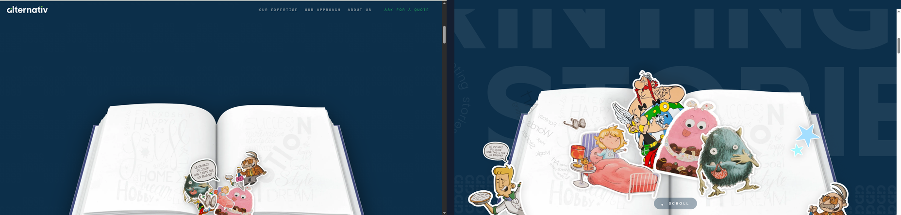

# FINAL 2% — Side-by-Side Truth Table

**Rig:** Playwright headed Chromium · viewport 1536×743 · deviceScaleFactor 1.25 · real wheel events, 150px steps, 150ms settle. All frames 1920×929 — apples-to-apples with the CANON references.

**Layout of each pair image:** `OURS` on the **left**, `CANON` reference on the **right**.

> ⚠️ Note on phase mapping: our whole hero sequence is compressed into ~600px of scroll, so phases are paired by **visual state**, not by raw scroll-y. See PUNCHLIST P9 (motion timing).

---

## 1. REST — `ours step-00` ↔ `CANON_cp00_y0`

- **Type mass:** Ours `PRINTING/STORIES` fills ~75% width and is pinned to the top; canon is ~45% width, vertically centered with generous L/R margins and headroom. Ours shouts, canon breathes. → **P0**
- **Nav:** Ours is ALL-CAPS + heavy letter-spacing, crammed to the right; canon is Title Case, evenly weighted. Ours is **missing** the globe/`En` language switch and the `MENU` circle. → **P1 / P3**
- **Seal:** Ours smaller, sits low-right; canon larger, cleanly forms the `O` between PRINTING and STORIES.
- **SCROLL pill:** present in canon (bottom center); **absent** in ours.

## 2. EARLY FADE — `ours step-01 (y98)` ↔ `CANON_cp01_y350`

- Canon dims `STORIES` toward grey while holding scale and margins; ours fades but the oversized type from P0 carries through. Same root composition delta.

## 3. MID-RISE — `ours step-02 (y238)` ↔ `CANON_cp02_y700`

- Canon at mid-rise has the text nearly gone and the pristine book rising into an empty field. Ours still shows readable text **and** the book is already opening — the phases overlap (motion is compressed). → **P9**

## 4. GHOST STATE — `ours step-03 (y400)` ↔ `CANON_cp03_y850`

- **The signature miss:** canon scales `PRINTING STORIES` into enormous, faint **ghost letters** filling the frame behind the rising book. Ours has **no ghost layer** — plain navy behind the book. → **P0/P1**
- At this equivalent point canon's pages are still **pristine** (no stickers); ours has **already started blooming**. Bloom fires too early. → **P9**

## 5. BLOOM PEAK — `ours step-06 (y843)` ↔ `CANON_cp05_y1150`

Detail crops: `crops/ours-bloom6.png` vs `crops/canon-bloom.png`

- **Bloom density/scale:** canon characters are **large**, span both pages and spill **above** the book's top edge (Asterix/Obelix, big pink monster, grey monster, bed). Ours are **small** (~130px), clustered at the gutter/center-bottom, leaving large empty page areas. → **P0**
- **Edge characters:** canon has characters escaping the page perimeter; ours keeps everything inside the book. → **P8**
- **Page lettering:** ours hand-lettering reads darker/busier; canon's print is faint so pages glow. → **P10**

## 6. LANDING — `ours step-08 (y1142)` ↔ `CANON_landing_y1650`

- Canon lands as a physical book (thick cover + spine), characters standing up pop-up style, side characters framing it, ghost letters behind. Ours lands the book then cuts to a `FOIL BLOCKING · PERFECT BOUND` marquee — flatter, fewer characters, no ghost, no edge cast.

---

### Evidence index
- Our sequence: `ours/step-00-rest.png` … `ours/step-14-y2014.png` (15 frames)
- Pairs: `pairs/01-rest.png` … `pairs/06-landing.png`
- Zoom crops: `crops/ours-nav.png`, `crops/canon-nav.png`, `crops/ours-seal.png`, `crops/canon-seal.png`, `crops/pill-*.png`, `crops/*-bloom*.png`
